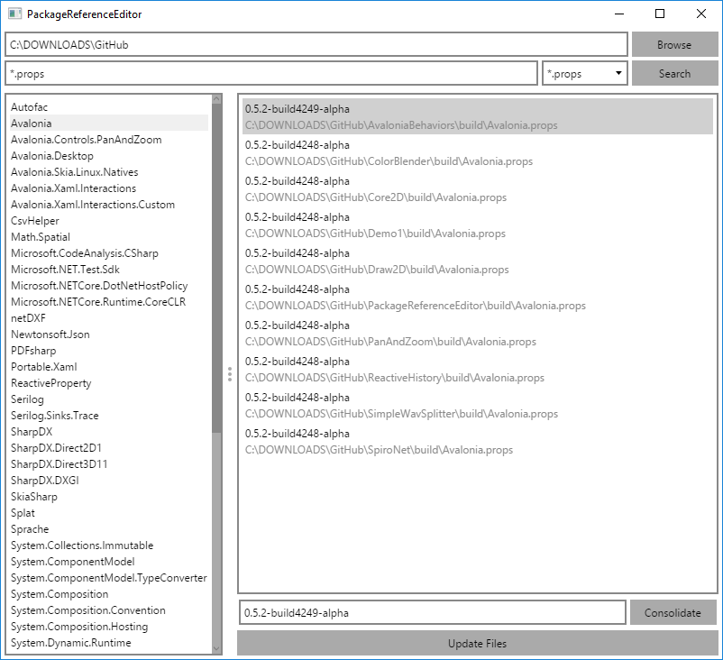

# PackageReferenceEditor

[](https://dev.azure.com/wieslawsoltes/GitHub/_build/latest?definitionId=57)

[](https://www.nuget.org/packages/PackageReferenceEditor)
[](https://www.myget.org/gallery/packagereferenceeditor-nightly) 

[](https://github.com/wieslawsoltes/packagereferenceeditor)
[](https://github.com/wieslawsoltes/packagereferenceeditor)
[](https://github.com/wieslawsoltes/packagereferenceeditor)

MSBuild, csproj and props package reference editor.

## Downloads

| Platform              | Type        | Version       | Download                                                                                                                                                                                        |
|-----------------------|-------------|---------------|-------------------------------------------------------------------------------------------------------------------------------------------------------------------------------------------------|
| All                   | NuGet       | 0.8.0         | [PackageReferenceEditor.0.8.0.nupkg](https://github.com/wieslawsoltes/packagereferenceeditor/releases/download/0.8.0/PackageReferenceEditor.0.8.0.nupkg)                                        |
| osx.10.12-x64         | Portable    | 0.8.0         | [PackageReferenceEditor.Avalonia-osx.10.12-x64.zip](https://github.com/wieslawsoltes/packagereferenceeditor/releases/download/0.8.0/PackageReferenceEditor.Avalonia-osx.10.12-x64.zip)          |
| ubuntu.14.04-x64      | Portable    | 0.8.0         | [PackageReferenceEditor.Avalonia-ubuntu.14.04-x64.zip](https://github.com/wieslawsoltes/packagereferenceeditor/releases/download/0.8.0/PackageReferenceEditor.Avalonia-ubuntu.14.04-x64.zip)    |
| win7-x64              | Portable    | 0.8.0         | [PackageReferenceEditor.Avalonia-win7-x64.zip](https://github.com/wieslawsoltes/packagereferenceeditor/releases/download/0.8.0/PackageReferenceEditor.Avalonia-win7-x64.zip)                    |

## Screenshots



## NuGet

PackageReferenceEditor is delivered as a NuGet package.

You can find the packages here [NuGet](https://www.nuget.org/packages/PackageReferenceEditor/) and install the package like this:

`Install-Package PackageReferenceEditor`

### NuGet Packages

* [PackageReferenceEditor](https://www.nuget.org/packages/PackageReferenceEditor/).

### Package Sources

* https://api.nuget.org/v3/index.json

## Example Usage with Cake build scripts

Same code can be used in C# programs by removing `#addin` directive and installing package from NuGet.

### Print package versions
```C#
#addin "nuget:?package=PackageReferenceEditor"

using PackageReferenceEditor;

Updater.FindReferences("./build", "*.props", new string[] { }).PrintVersions();
Updater.FindReferences("./", "*.csproj", new string[] { }).PrintVersions();	
```

### Validate package versions

```C#
#addin "nuget:?package=PackageReferenceEditor"

using PackageReferenceEditor;

Updater.FindReferences("./build", "*.props", new string[] { }).ValidateVersions();
Updater.FindReferences("./", "*.csproj", new string[] { }).ValidateVersions();
```

### Update package version

```C#
#addin "nuget:?package=PackageReferenceEditor"

using PackageReferenceEditor;

Updater.FindReferences("./build", "*.props", new string[] { }).UpdateVersions("Newtonsoft.Json", "10.0.3");
```

### Get installed package versions
```C#
#addin "nuget:?package=PackageReferenceEditor"

using PackageReferenceEditor;

var result = Updater.FindReferences("./build", "*.props", new string[] { });
result.ValidateVersions();
var version = result.GroupedReferences["Newtonsoft.Json"].FirstOrDefault().Version;
Information("Newtonsoft.Json package version: {0}", version);
```

### Get available package versions
```C#
#addin "nuget:?package=PackageReferenceEditor"

using PackageReferenceEditor;
using System.Linq;

var versions = NuGetApi.GetPackageVersions("https://api.nuget.org/v3/index.json", "Newtonsoft.Json").Result;
var latestVersion = versions.Reverse().FirstOrDefault();
Information("Newtonsoft.Json package latest version: {0}", latestVersion);
```

## Resources

* [GitHub source code repository.](https://github.com/wieslawsoltes/PackageReferenceEditor)

## License

PackageReferenceEditor is licensed under the [MIT license](LICENSE.TXT).
